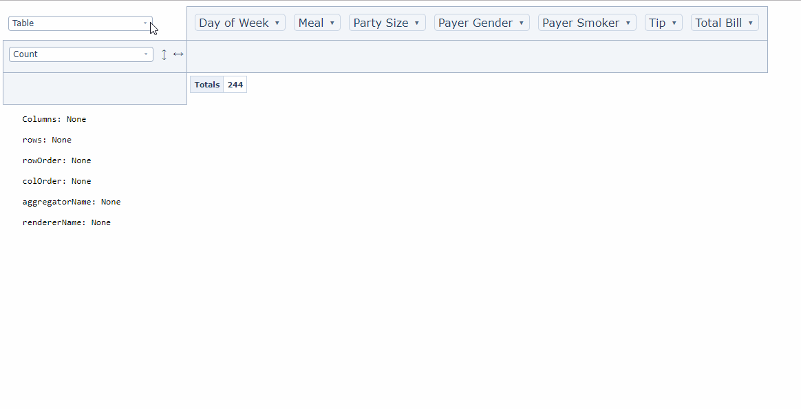

[](https://cran.r-project.org/web/packages/dashPivottable/index.html)
[](https://cran.r-project.org/package=dashPivottable)
[](https://cran.r-project.org/package=dashPivottable)

# Dash Pivottable

Dash Pivottable is a Dash component wrapping the [react-pivottable library](https://github.com/plotly/react-pivottable/), created by Nicolas Kruchten. It lets you build interactive pivot tables using purely Python.



## Getting Started

### Install with virtualenv
First, install `virtualenv` with `pip install virtualenv`.

Then, make sure to clone this project, create a venv and install requirements:
```commandline
git clone https://github.com/plotly/dash-pivottable.git
cd dash_pivottable
python3 -m venv ./venv
source venv/bin/activate
pip install -r requirements.txt
```

And simply run the example in the venv:
```commandline
python usage.py
```

## References

The following parameters can be modified:
- `id` *(string; optional)*: The ID used to identify this component in Dash callbacks
- `data` *(list; optional)*: The input data
- `hiddenAttributes` *(list; optional)*: contains attribute names to omit from the UI
- `hiddenFromAggregators` *(list; optional)*: contains attribute names to omit from the aggregator arguments dropdowns
- `hiddenFromDragDrop` *(list; optional)*: contains attribute names to omit from the drag'n'drop portion of the UI
- `menuLimit` *(number; optional)*: maximum number of values to list in the double-click menu
- `unusedOrientationCutoff` *(number; optional)*: If the attributes' names' combined length in characters exceeds this
value then the unused attributes area will be shown vertically to the
left of the UI instead of horizontally above it. 0 therefore means
'always vertical', and Infinity means 'always horizontal'.

The following props can be used as an input to callbacks, but can't be modified:
- `cols` *(list; optional)*: Which columns are currently in the column area
- `colOrder` *(string; optional)*: The order in which column data is provided to the renderer, must be one
of "key_a_to_z", "value_a_to_z", "value_z_to_a", ordering by value
orders by column total
- `rows` *(list; optional)*: Which rows is currently inside the row area.
- `rowOrder` *(string; optional)*: The order in which row data is provided to the renderer, must be one
of "key_a_to_z", "value_a_to_z", "value_z_to_a", ordering by value
orders by row total
- `aggregatorName` *(string; optional)*: Which aggregator is currently selected. E.g. Count, Sum, Average, etc.
- `vals` *(list; optional)*: Attribute names used as arguments to aggregator (gets passed to aggregator generating function)
- `rendererName` *(string; optional)*: Which renderer is currently selected. E.g. Table, Line Chart, Scatter
- `valueFilter` *(dictionnary; optional)*: Object whose keys are attribute names and values are objects of attribute value-boolean pairs which denote records to include or exclude from computation and rendering; used to prepopulate the filter menus that appear on double-click

Default Values:
* `menuLimit`: 500
* `unusedOrientationCutoff`: 85
* `hiddenAttributes`: []
* `hiddenFromAggregators`: []
* `hiddenFromDragDrop`: []


## FAQ

You can find the following FAQs in contributing.md:
- [Using a modified version of `react-pivottable` in your own `dash-pivottable` project](https://github.com/plotly/dash-pivottable/blob/master/CONTRIBUTING.md#contributing-faq)
